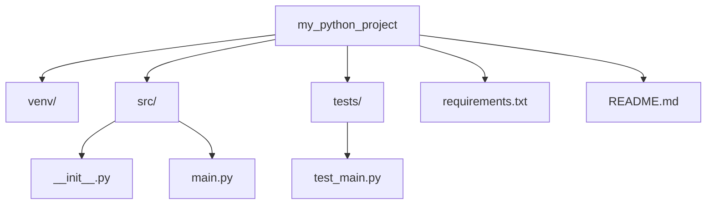

# Creating a Python Project

## Create a project Directory

```cmd
mkdir my_project
cd my_project
cd 
```

## Setup a Virtual Environment

```cmd
python -m venv venv
source venv/bin/activate  # On Windows, use `venv\Scripts\activate`
```

## Install Dependencies

```cmd
pip install request flask
pip install bs4
```

### Create a `requirement.txt` file to keep track of dependencies

```cmd
pip freeze > requirement.txt
```

## Project Structure



```raw-view
my_python_project/
│
├── venv/                # Virtual environment
├── src/                # Source code
│   ├── __init__.py     # Makes src a package
│   └── main.py         # Main application file
├── tests/              # Unit tests
│   └── test_main.py    # Test cases for main.py
├── requirements.txt     # List of dependencies
└── README.md            # Project documentation
```

## Write Code

Create a `src` director and create a `main.py` file

## Write Tests

If you’re following best practices, write `tests` for your code in the tests directory. You can use frameworks like `unittest` or `pytest`.

## Version Control with Git

```cmd
git init
git add .
git commit -m "Initial commit"
```

## Document the project

Write a `Readme.md` file to explain what your project does, how to set it up, and how to use it.

## Run Your Project

```cmd
python src/main.py
```

## Share the Project

Publish the project to platform like `GitHub` or `GitLab`
